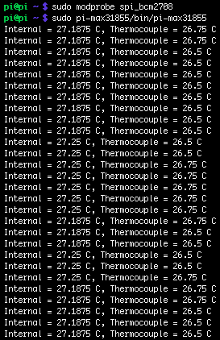
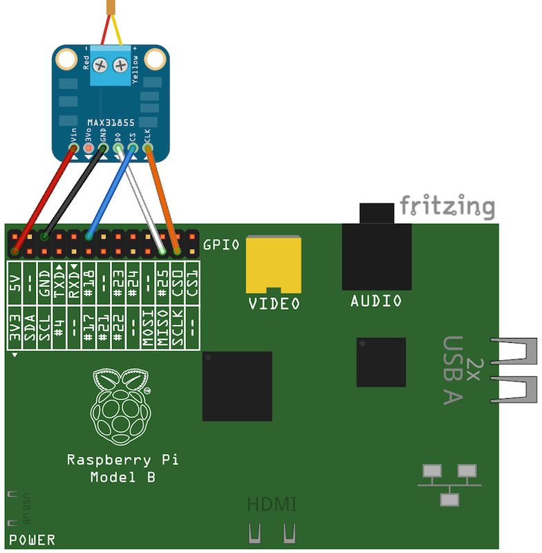

# Screenshot


# Instructions
## Wiring


## Computer
```bash
$ ./gradlew distZip
```
* ZIP file will be located in build/distributions
* Copy pi-max31855.zip to your Raspberry Pi

## Raspberry Pi
```bash
$ unzip pi-max31855.zip
$ sudo bin/pi-max31855
```
