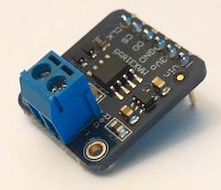
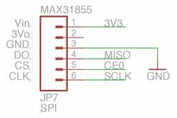
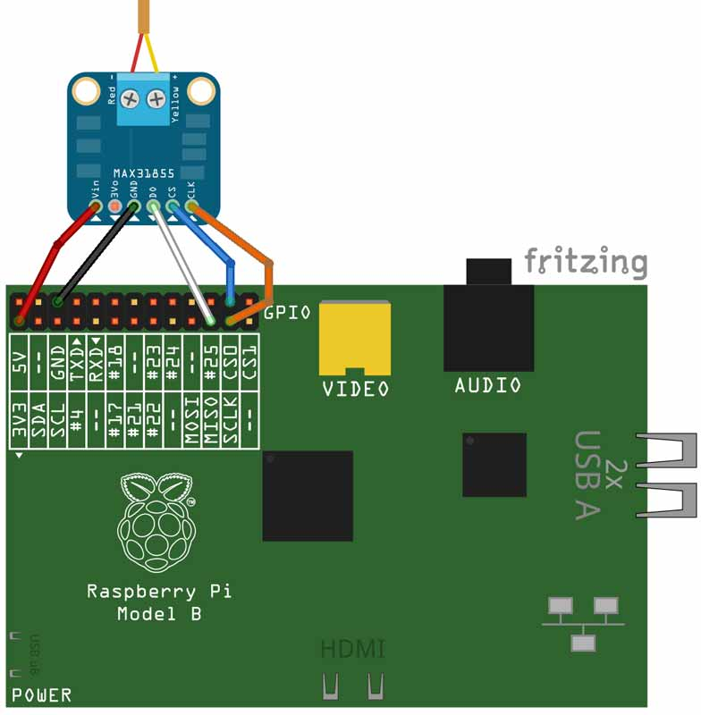

# Screenshot


# Instructions
## Schematic


## Wiring


## Computer
* Compile project
  * OS X/Linux: `$ ./gradlew distZip`
  * Windows `gradlew.bat distZip`
* ZIP file will be located in build/distributions
* Copy pi-max31855.zip to your Raspberry Pi

## Raspberry Pi
```bash
$ unzip pi-max31855.zip
$ cd pi-max31855
$ sudo bin/pi-max31855
```
